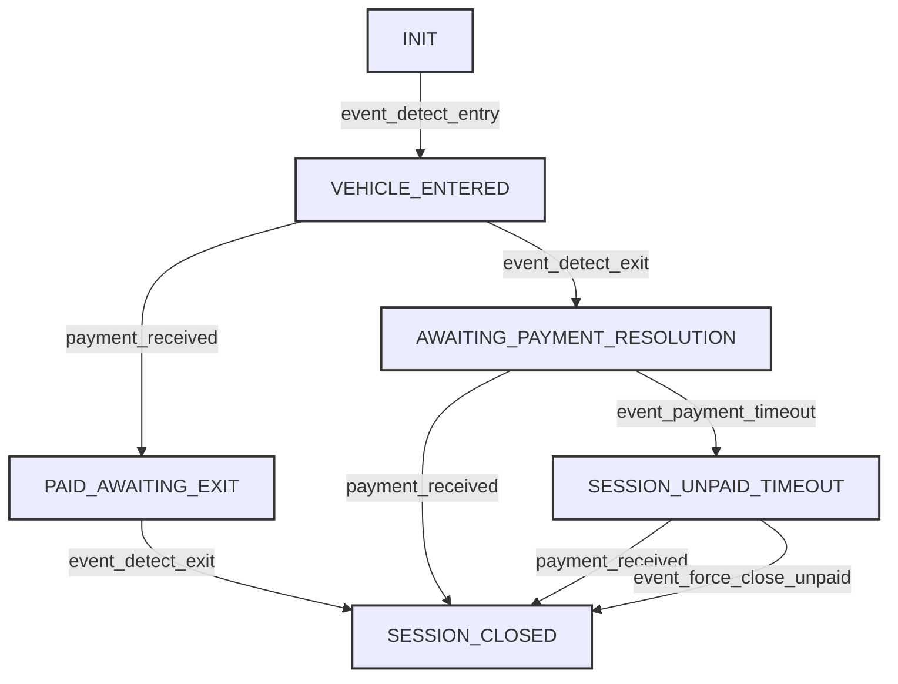

# Parking Session State Machine Diagram

This document provides a visual representation and explanation of the `ParkingSessionStateMachine` used in the ConvALPR system.

## Mermaid Diagram

## Explanation of States

*   **`INIT`**: 
    *   The initial state before any parking event is processed for a new session. 
    *   Not typically persisted as the primary state for active sessions once an entry event occurs.
*   **`VEHICLE_ENTERED`**: 
    *   A vehicle has been detected entering the parking facility, and a new session is active.
*   **`AWAITING_PAYMENT_RESOLUTION`**: 
    *   The vehicle has been detected at an exit point (or a common camera acting as an exit).
    *   The system is now waiting for payment to be made or for the grace period to expire.
*   **`PAID_AWAITING_EXIT`**: 
    *   Payment for the session has been successfully received and confirmed while the vehicle is still considered to be inside the parking facility (i.e., an exit detection event has not yet occurred for this paid session).
*   **`SESSION_UNPAID_TIMEOUT`**: 
    *   The grace period (initiated after an exit detection when the session was in `AWAITING_PAYMENT_RESOLUTION`) has expired without any payment confirmation.
*   **`SESSION_CLOSED`**: 
    *   The parking session is fully concluded. This can happen after a successful payment or after the session is closed as unpaid following a timeout. This is a terminal state.

## Explanation of Transitions (Events)

*   **`event_detect_entry`**: 
    *   Triggered by the ALPR service when a vehicle is detected entering the facility.
    *   Transitions `INIT` to `VEHICLE_ENTERED`.
*   **`event_detect_exit`**: 
    *   Triggered by the ALPR service when a vehicle is detected at an exit point.
    *   Transitions `VEHICLE_ENTERED` to `AWAITING_PAYMENT_RESOLUTION`.
    *   Transitions `PAID_AWAITING_EXIT` to `SESSION_CLOSED`.
*   **`payment_received`**: 
    *   Triggered by the Cashier service when a payment for the session is successfully processed.
    *   Transitions `VEHICLE_ENTERED` to `PAID_AWAITING_EXIT` (if payment made before exit detection).
    *   Transitions `AWAITING_PAYMENT_RESOLUTION` to `SESSION_CLOSED` (if payment made after exit detection but before timeout).
    *   Transitions `SESSION_UNPAID_TIMEOUT` to `SESSION_CLOSED` (if payment is allowed and made after a timeout).
*   **`event_payment_timeout`**: 
    *   Triggered (typically by the Web Portal) when the payment grace period expires for a session that was in the `AWAITING_PAYMENT_RESOLUTION` state.
    *   Transitions `AWAITING_PAYMENT_RESOLUTION` to `SESSION_UNPAID_TIMEOUT`.
*   **`event_force_close_unpaid`**: 
    *   An optional event that can be triggered (e.g., by an administrative action or a batch process) to formally close a session that has already timed out.
    *   Transitions `SESSION_UNPAID_TIMEOUT` to `SESSION_CLOSED`.

This diagram and explanation detail the lifecycle of a parking session as managed by the `ParkingSessionStateMachine` in `common/session_state_machine.py`.
