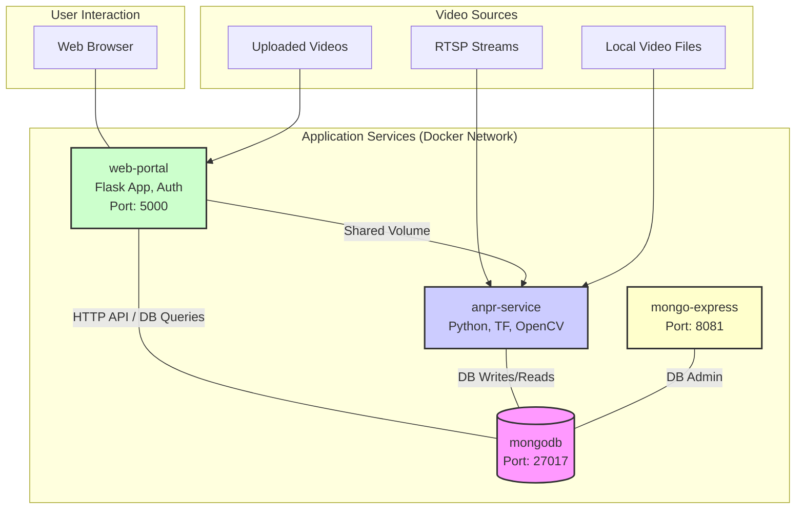

# ANPR Multi-Service Application Documentation

## 1. Introduction

This document describes the ANPR (Automatic Number Plate Recognition) Multi-Service Application. The system is designed for real-time license plate identification from various video sources, implements parking lot management logic (tracking vehicle entries and exits), and provides a web-based interface for visualization, configuration, and user management. It is deployed as a set of containerized microservices using Docker Compose.

## 2. System Architecture

The application utilizes a microservices architecture orchestrated by Docker Compose. It consists of four main services that communicate over a shared Docker network. Persistent data (MongoDB database files, detected plate images, uploaded videos) is managed using Docker volumes.

**Services Overview:**

*   **`anpr-service`**: The core engine responsible for video processing, license plate detection and recognition (using TensorFlow-based models), applying parking logic, saving detection images, and logging data to MongoDB.
*   **`mongodb`**: A NoSQL database used as the central data store for all application data, including raw detections, parking sessions, stream configurations, processing jobs, and user accounts.
*   **`mongo-express`**: A web-based administrative UI for MongoDB, allowing direct database inspection and management.
*   **`web-portal`**: A Flask-based web application providing user interaction features such as viewing detections and parking sessions, uploading videos for processing, managing persistent video stream configurations, and user administration. It includes authentication and role-based access control.

**Conceptual Diagram:**

## 3. Services Details

### 3.1. `anpr-service`
*(Content remains the same)*
*   **Description**: This is the heart of the system. It ingests video from configured streams and uploaded files, performs ANPR using custom TensorFlow models for plate detection and OCR, implements parking session logic, and logs relevant data.
*   **Key Technologies**: Python, OpenCV, TensorFlow, PyMongo.
*   **Core Logic**:
    *   **Video Ingestion**: Processes persistent video streams and on-demand uploaded files. Handles multiple streams concurrently with robust reconnection logic.
    *   **ANPR Processing**: Uses YOLO-based TensorFlow model for detection and a custom CNN model for OCR.
    *   **Parking Session Logic**: Tracks entries/exits based on plates and camera roles, storing data in `parking_sessions`. Supports "entry", "exit", "common", "monitoring" roles.
    *   **Plate Detection Cooldown**: Prevents re-processing the same plate by the same camera within a configurable period (default: 5 minutes), tracked in `plate_last_seen_log`.
    *   **Image Saving**: Saves detected plate images to a shared volume.
    *   **Data Logging**: Logs to `parking_sessions`, `detections` (optional raw logs), and `plate_last_seen_log`.
*   **Build & Location**: Source: `alpr/`, Dockerfile: `anpr/Dockerfile`.

### 3.2. `mongodb`
*(Content remains the same, `users` collection already listed)*
*   **Description**: Primary data store.
*   **Key Technologies**: MongoDB.
*   **Port**: `27017`.
*   **Database Name**: `anpr_db` (default).
*   **Key Collections**: `detections`, `parking_sessions`, `stream_configs`, `video_jobs`, `plate_last_seen_log`, `users`.
*   **Data Volume**: `anpr_db_data`.

### 3.3. `mongo-express`
*(Content remains the same)*
*   **Description**: Web UI for MongoDB administration.
*   **Access**: `http://localhost:8081`. Credentials: `admin`/`password` (default).

### 3.4. `web-portal`

*   **Description**: A Flask web application providing the user interface with authentication and role-based access control.
*   **Key Technologies**: Python, Flask, PyMongo, HTML/CSS, Flask-Login, Flask-Bcrypt.
*   **Access**: `http://localhost:5000`
*   **Features**:
    *   **User Authentication**: Secure login/logout. Passwords hashed. Initial default admin user (`admin`/`admin`) created (password should be changed).
    *   **Role-Based Access Control (RBAC)**: Supports "admin", "operator", "supervisor", and "technical" roles with different permissions.
    *   **Parking Sessions Display**: Shows a table of current and past parking sessions.
    *   **Raw Detections Log**: Displays a log of raw ANPR detections.
    *   **Video Upload (Admin/Supervisor/Technical)**: Allows authenticated users with "admin", "supervisor", or "technical" roles to upload video files for on-demand ANPR processing. (Operator access removed).
    *   **Stream Management (Admin/Technical)**: Users with "admin" or "technical" roles can add, view, and delete configurations for persistent video streams, including assigning camera roles.
    *   **Session Editing (Admin/Supervisor)**: Users with "admin" or "supervisor" roles can manually edit details of parking sessions (e.g., status, exit time).
    *   **User Management (Admin/Supervisor)**:
        *   **Admins**: Can list, create, edit (passwords/roles), and delete all users (with safeguards for the last admin and self-deletion).
        *   **Supervisors**: Can list and edit users (passwords/roles), but cannot edit the primary 'admin' user, cannot grant the 'admin' role, and cannot delete users.
*   **Build & Location**: Source: `web_portal/`, Dockerfile: `web_portal/Dockerfile`.
*   **Shared Volume**: Mounts `anpr_images` to `/app/static/detections`.

## 4. Data Flow Example (Parking Logic)
*(Content remains the same)*

## 5. Key Features Summary

*   Microservice architecture using Docker Compose.
*   Real-time ANPR from multiple concurrent video streams.
*   TensorFlow-based models for plate detection and OCR.
*   Parking lot management with entry/exit tracking and session storage.
*   Configurable camera roles for parking logic.
*   **User Authentication and Role-Based Access Control (Admin, Operator, Supervisor, Technical)**.
*   Web portal for:
    *   Viewing parking sessions and raw detections.
    *   Video upload (admin/supervisor/technical).
    *   **Role-specific features**: Stream management (admin/technical), Session editing (admin/supervisor), User management (admin can CRUD; supervisor can list/edit with restrictions).
*   Configurable plate detection cooldown period per camera.
*   Optional raw detection logging.
*   Visual database exploration via Mongo Express.
*   Robust stream handling with reconnection attempts.

## 6. Deployment
*(Content remains the same)*

## 7. Configuration
*(Content remains the same, `FLASK_SECRET_KEY` already listed)*

## 8. Project Directory Structure Overview
*(Content remains the same)*

## 9. Minimum System Requirements (Estimates)
*(Content remains the same)*

These are general guidelines. It's advisable to monitor system resource usage (CPU, RAM, disk I/O) under your specific workload to determine if upgrades are necessary.
