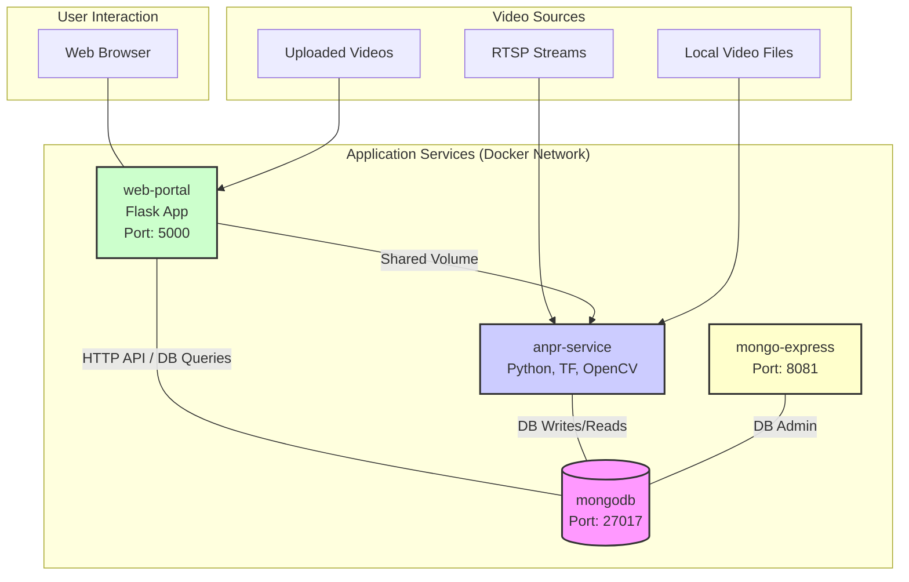

# ANPR Multi-Service Application Documentation

## 1. Introduction

This document describes the ANPR (Automatic Number Plate Recognition) Multi-Service Application. The system is designed for real-time license plate identification from various video sources, implements parking lot management logic (tracking vehicle entries and exits), and provides a web-based interface for visualization and configuration. It is deployed as a set of containerized microservices using Docker Compose.

## 2. System Architecture

The application utilizes a microservices architecture orchestrated by Docker Compose. It consists of four main services that communicate over a shared Docker network. Persistent data (MongoDB database files, detected plate images, uploaded videos) is managed using Docker volumes.

**Services Overview:**

*   **`anpr-service`**: The core engine responsible for video processing, license plate detection and recognition (using TensorFlow-based models), applying parking logic, saving detection images, and logging data to MongoDB.
*   **`mongodb`**: A NoSQL database used as the central data store for all application data, including raw detections, parking sessions, stream configurations, and processing jobs.
*   **`mongo-express`**: A web-based administrative UI for MongoDB, allowing direct database inspection and management.
*   **`web-portal`**: A Flask-based web application providing user interaction features such as viewing detections and parking sessions, uploading videos for processing, and managing persistent video stream configurations.

**Conceptual Diagram:**



## 3. Services Details

### 3.1. `anpr-service`

*   **Description**: This is the heart of the system. It ingests video from configured streams and uploaded files, performs ANPR using custom TensorFlow models for plate detection and OCR, implements parking session logic, and logs relevant data.
*   **Key Technologies**: Python, OpenCV, TensorFlow, PyMongo.
*   **Core Logic**:
    *   **Video Ingestion**:
        *   Processes persistent video streams (e.g., RTSP, local files) configured via the web portal and stored in MongoDB.
        *   Processes on-demand video files uploaded via the web portal.
        *   Handles multiple streams concurrently using threading.
        *   Includes robust reconnection logic for persistent streams with exponential backoff.
    *   **ANPR Processing**:
        *   Detects license plates in video frames using a YOLO-based TensorFlow model.
        *   Performs Optical Character Recognition (OCR) on detected plates using a custom TensorFlow CNN model.
    *   **Parking Session Logic**:
        *   Tracks vehicle entries and exits based on detected plates and camera roles.
        *   Stores session data (entry/exit times, images, status) in the `parking_sessions` MongoDB collection.
        *   Supports camera roles ("entry", "exit", "common", "monitoring") for nuanced parking logic.
        *   For "common" (single entry/exit) cameras, the first detection is an entry, and the second is an exit for a given plate.
    *   **Plate Detection Cooldown**:
        *   Prevents re-processing the same plate from the same camera if detected again within a configurable cooldown period (default: 5 minutes). This is tracked in the `plate_last_seen_log` collection.
    *   **Image Saving**: Saves images of detected plates to a shared Docker volume (`anpr_images`, accessible at `/app/detections` within the container).
    *   **Data Logging**:
        *   Logs parking session events to the `parking_sessions` collection.
        *   Optionally logs all raw detections to the `detections` collection (controlled by `LOG_RAW_DETECTIONS` environment variable).
        *   Logs cooldown events to `plate_last_seen_log`.
*   **Build & Location**:
    *   Source code: `alpr/` directory (contains `service_main.py`, `alpr.py`, `saver.py`, `detector.py`, `ocr.py`, and `models/`).
    *   Dockerfile: `anpr/Dockerfile`.
    *   Build context (in `docker-compose.yml`): Project root (`.`).

### 3.2. `mongodb`

*   **Description**: The primary data store for the application.
*   **Key Technologies**: MongoDB (NoSQL Document Database).
*   **Port**: `27017` (exposed to host).
*   **Database Name**: `anpr_db` (default, configurable via `DB_NAME` env var for `anpr-service`).
*   **Key Collections**:
    *   `detections`: Stores raw ANPR detection records (timestamp, plate, confidence, image path, camera ID) if raw logging is enabled.
    *   `parking_sessions`: Stores parking session data (plate, entry/exit details, status, duration).
    *   `stream_configs`: Stores configurations for persistent video streams (name, URL, role) managed via the web portal.
    *   `video_jobs`: Tracks uploaded video files queued for processing.
    *   `plate_last_seen_log`: Stores the last processing timestamp for each plate/camera pair to manage the detection cooldown.
*   **Data Volume**: `anpr_db_data` (Docker named volume for persistence).

### 3.3. `mongo-express`

*   **Description**: A web-based administrative interface for MongoDB.
*   **Access**: `http://localhost:8081`
*   **Credentials (default)**:
    *   Username: `admin`
    *   Password: `password`
    (Configurable via environment variables in `docker-compose.yml`).
*   **Functionality**: Allows browsing databases and collections, viewing/editing documents, running queries, etc.

### 3.4. `web-portal`

*   **Description**: A Flask web application providing the user interface.
*   **Key Technologies**: Python, Flask, PyMongo, HTML/CSS.
*   **Access**: `http://localhost:5000`
*   **Features**:
    *   **Parking Sessions Display**: Shows a table of current and past parking sessions with details like plate number, status, entry/exit times, images, and duration.
    *   **Raw Detections Log**: Displays a log of raw ANPR detections (if enabled and data exists).
    *   **Video Upload**: Allows users to upload video files for on-demand ANPR processing. Uploaded files are saved to a shared volume and a job is queued in MongoDB for `anpr-service`.
    *   **Stream Management**: Allows users to add, view, and delete configurations for persistent video streams (e.g., RTSP feeds). Stream configurations include name, URL, and camera role ("entry", "exit", "common", "monitoring").
*   **Build & Location**:
    *   Source code: `web_portal/` directory (contains `app.py`, `templates/index.html`).
    *   Dockerfile: `web_portal/Dockerfile`.
*   **Shared Volume**: Mounts `anpr_images` to `/app/static/detections` to serve detection images and store/access uploaded videos.

## 4. Data Flow Example (Parking Logic)

1.  A persistent stream (e.g., "EntryCam1", role: "entry") is configured via the web portal and stored in `stream_configs`.
2.  `anpr-service` starts, reads this config, and begins processing frames from "EntryCam1".
3.  A vehicle with plate "ABC123" passes "EntryCam1".
4.  `ALPR.process_frame` in `anpr-service` detects "ABC123".
5.  **Cooldown Check**: `plate_last_seen_log` is checked for "ABC123" at "EntryCam1". If not recently seen (outside cooldown), processing continues.
6.  **Parking Logic**:
    *   `parking_sessions` is checked for an active session for "ABC123". None found.
    *   Since camera role is "entry", a new session is created in `parking_sessions`: `{plate_number: "ABC123", entry_timestamp: now, entry_camera_id: "EntryCam1", entry_image_path: "...", status: "inside", ...}`.
7.  **Raw Log**: If enabled, a record is added to `detections`.
8.  **Cooldown Update**: `plate_last_seen_log` is updated for ("ABC123", "EntryCam1") with the current timestamp.
9.  Later, the same vehicle passes an "ExitCam1" (role: "exit").
10. Detection occurs, cooldown check passes (different camera or time elapsed).
11. **Parking Logic**:
    *   Active session for "ABC123" is found.
    *   Camera role is "exit", so the session is updated: `exit_timestamp`, `exit_image_path`, `exit_camera_id` are set, `status` becomes "exited".
12. Raw log and cooldown log updated.
13. Web portal, on refresh, shows the updated session for "ABC123" including duration.

## 5. Key Features Summary

*   Microservice architecture using Docker Compose.
*   Real-time ANPR from multiple concurrent video streams.
*   TensorFlow-based models for plate detection and OCR.
*   Parking lot management:
    *   Tracks vehicle entry and exit events.
    *   Stores parking sessions with entry/exit images and timestamps.
    *   Calculates parking duration (displayed in web portal).
*   Configurable camera roles ("entry", "exit", "common", "monitoring") for flexible parking logic.
*   Web portal for:
    *   Viewing parking sessions and raw detections.
    *   Uploading video files for on-demand processing.
    *   Managing persistent video stream configurations.
*   Configurable cooldown period to prevent re-processing of the same plate by the same camera within a short time.
*   Optional logging of all raw detections for auditing.
*   Visual database exploration via Mongo Express.
*   Robust stream handling with reconnection attempts for persistent streams.

## 6. Deployment

*   **Prerequisites**: Docker and Docker Compose installed.
*   **Command**: From the project root directory, run:
    ```bash
    docker compose up --build -d
    ```
    This builds the custom service images (`anpr-service`, `web-portal`) if they don't exist or if their build context has changed, and starts all services in detached mode.
*   **Applying Stream Configuration Changes**: After adding or deleting persistent streams via the web portal, the `anpr-service` must be restarted to pick up these changes:
    ```bash
    docker compose restart anpr-service
    ```
*   **Stopping Services**:
    ```bash
    docker compose down
    ```
    To also remove volumes (deleting all data): `docker compose down -v`.

## 7. Configuration

*   **`anpr-service`**: Configured primarily via environment variables set in the `docker-compose.yml` file. Key configurable parameters include:
    *   `MONGO_URI`: MongoDB connection string.
    *   `DB_NAME`: Name of the MongoDB database to use (default: `anpr_db`).
    *   `DETECTOR_INPUT_SIZE`: Input image resolution for the plate detector model.
    *   `DETECTOR_CONFIDENCE_THRESHOLD`: Minimum confidence for plate detection.
    *   `OCR_MODEL_NUMBER`: Which OCR model to use.
    *   `OCR_AVG_CONFIDENCE_THRESHOLD`: Minimum average character confidence for OCR.
    *   `OCR_LOW_CONFIDENCE_THRESHOLD`: Minimum confidence for any single character in OCR.
    *   `INFERENCE_FREQUENCY_FRAMES`: Process one frame every N frames.
    *   `LOG_RAW_DETECTIONS`: Boolean (`true`/`false`) to enable/disable logging to the raw `detections` collection (default: `true`).
    *   `PLATE_DETECTION_COOLDOWN_SECONDS`: Cooldown period in seconds for plate re-detections (default: `300`).
*   **Persistent Video Streams**: Configured via the web portal (`http://localhost:5000`). This includes stream name, URL (RTSP or file path accessible to `anpr-service`), and camera role. These are stored in the `stream_configs` MongoDB collection.
*   **`mongo-express`**: Credentials configured via environment variables in `docker-compose.yml`.

## 8. Project Directory Structure Overview

*   `alpr/`: Contains Python source code for the `anpr-service` (`service_main.py`, `alpr.py`, `saver.py`, `detector.py`, `ocr.py`) and the TensorFlow models (`alpr/models/`). Also includes `alpr/requirements.txt`.
*   `anpr/`: Contains the `Dockerfile` for building the `anpr-service` image.
*   `web_portal/`: Contains Python source code (`app.py`), templates (`templates/index.html`), and `requirements.txt` for the Flask web portal. Also includes its `Dockerfile`.
*   `assets/`: Can be used to store local video files for testing (mounted into `anpr-service` at `/app/assets`). Debug frames are saved into a `debug_frames` subdirectory within the `anpr_images` volume, accessible at `/app/detections/debug_frames` in `anpr-service`.
*   `docker-compose.yml`: Main Docker Compose file for orchestrating all services.
*   `SYSTEM_DOCUMENTATION.md`: This file.

This documentation should provide a good overview of the system. Let me know if you have further questions as you study it!
